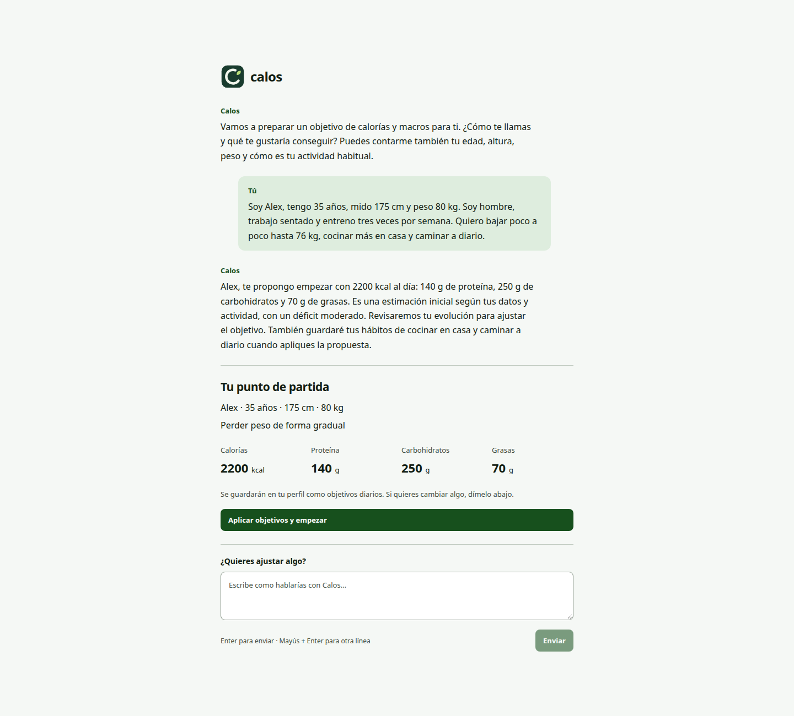
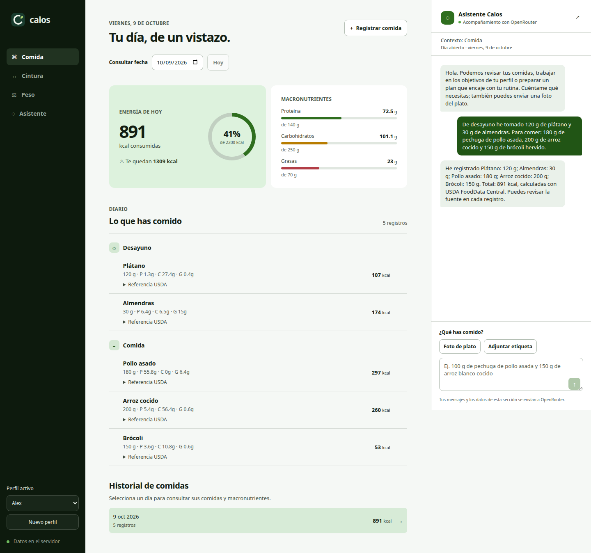
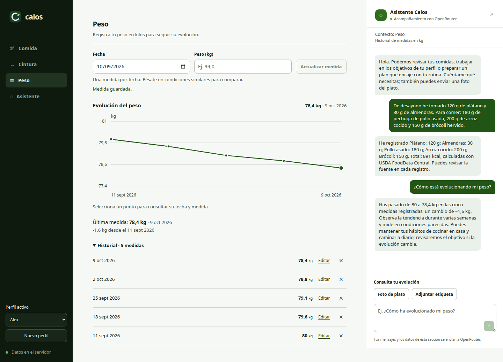

<div align="center">
  
  <h1>Calos</h1>
  <p><strong>Your meals, nutrition goals, and body measurements — in one personal diary.</strong></p>
  <p>
    
    
    
    
  </p>
</div>

Calos is a self-hosted nutrition diary for the browser. Describe what you ate,
attach a food label or a plate photo, and review calories and macros alongside
your weight and waist history. An OpenRouter assistant helps you set your initial
goals, record meals, and understand your progress.

The web app talks to a Node.js API. Profiles and diary entries stay on the server
you run; there is no Calos account or hosted Calos service. Assistant requests send
relevant information to OpenRouter.

> [!NOTE]
> Calos is under active development. The current interface is in Spanish; the
> screenshots below show the actual application with fictional sample data.

## What Calos does

- Creates profiles through a conversation instead of a setup form.
- Recommends initial calorie and macro targets, lets you discuss adjustments,
  and saves the proposal when you accept it.
- Records meals from natural language and asks for missing quantities.
- Calculates nutrition from a bundled USDA dataset, food labels, or your own references.
- Reads photographed nutrition labels and scales their values to your serving.
- Identifies possible ingredients in plate photos and asks about uncertain details.
- Labels estimated values and keeps their assumptions visible in the diary.
- Corrects quantities, food references, and meal dates through the assistant.
- Tracks daily calorie and macro totals against each profile's targets.
- Offers nutrition guidance and goal proposals that you can apply or discard.
- Charts weight and waist measurements, with editable dated entries.
- Keeps profiles separate and remembers the selected profile in each browser.

## Screenshots

### Conversational onboarding

Share your details, review the suggested daily targets, and adjust them before
creating your profile.



### Daily food diary

See recorded meals, calorie and macro totals, nutrition sources, and the assistant
in the same workspace.



### Weight history

Record measurements, follow the trend, and ask the assistant about the history
shown on screen.



These captures use the real web interface, HTTP API, nutrition calculations, and
isolated temporary storage. Only the external OpenRouter responses were simulated.

## Requirements

### To use Calos

- A modern browser and access to the server running Calos.
- An [OpenRouter API key](https://openrouter.ai/settings/keys) for onboarding and
  assistant conversations, including photos.
- A configured OpenRouter model that supports structured JSON responses; photo
  features also require image input support.

Existing diaries and manual measurements remain available without an assistant
connection. OpenRouter usage may incur charges depending on the selected model.

Profiles do not have passwords or separate access permissions. Anyone who can
reach the application can select any profile. The supplied deployment is intended
for a trusted local network.

### To develop Calos

- Node.js 24.
- pnpm 10.15.0, pinned in `package.json` and available through Corepack.
- Chromium installed through Playwright for E2E tests and screenshot capture.

The office deployment additionally requires Docker with BuildKit and Compose,
a running nginx service on Ubuntu, and administrator access for installing the
nginx site and static web files.

## Using Calos

### Create a profile

Tell the assistant your name, age, height, weight, activity, and goal. You can supply
several details in one message; it asks for anything still needed. Dietary
preferences, habits, and instructions for the assistant are optional.

Review the suggested calories and macros, ask for changes if needed, then choose
**Aplicar objetivos y empezar** to save the targets and create the profile. These
are initial estimates that can be adjusted as you record your progress.

Use **Perfil activo** to switch people or **Nuevo perfil** to start another
conversation. Switching profiles clears pending chat messages, drafts, and photos;
saved entries remain in their own profile.

### Record and correct meals

Describe the food, the amount, and the meal. Calos accepts grams, milliliters, and
liters. If a quantity is missing, the assistant asks before recording anything.
You can then correct an entry by telling it which food or amount should change.

For a matched USDA food, the app calculates nutrients from the local reference:

```text
serving nutrients = nutrients per 100 g × serving weight in grams / 100
```

Each entry keeps its source and serving information. Calories are rounded to whole
kcal and macros to one decimal place. A volume requiring a density conversion is
marked as approximate; a label with values per 100 ml is used directly.

### Use photos and personal food references

Use **Adjuntar etiqueta** for a nutrition label or **Foto de plato** for a meal
photo. Images must be JPEG, PNG, or WebP and no larger than 6 MB.

A readable label takes priority over USDA. Missing label values are not filled
with guessed nutrients. Plate photos can produce ingredient and weight estimates;
Calos keeps the draft while you answer questions and does not record it until the
required details are resolved.

You can also supply your own nutrition values and save reusable food references.
Explicit user values and personal references take priority over USDA, after any
attached label. Values supplied as ranges retain those ranges and use their
midpoints for totals, with an estimate notice.

When an exact reference is unavailable, the assistant can propose an estimate.
The diary shows that it is approximate and preserves the assumptions through
quantity corrections. Ask for **sin estimaciones** to require more precise inputs.

### Review goals and measurements

Open **Asistente** to review or edit daily calories, protein, carbohydrates, fat,
optional target weight and date, and habits. Ask for feedback or discuss a new
proposal. Advice alone does not write meals, measurements, or targets; choose
**Aplicar objetivos** to save a proposed plan.

Open **Peso** or **Cintura** to add, update, or delete a dated measurement and view
its history. Advice can use the selected day, recent meal records, and measurement
history. Missing records are not treated as a complete picture of your intake.

## Development

From the repository root, install dependencies and create your local configuration:

```bash
corepack enable
pnpm install --frozen-lockfile
cp .env.example .env
```

Set your OpenRouter configuration in `.env`:

```dotenv
OPENROUTER_API_KEY=your_openrouter_key
OPENROUTER_MODEL=google/gemini-3-flash-preview
```

The key is read only by the server API. It is never included in the browser build.
Environment variables override the file; `CALOS_ENV_FILE` selects a different
configuration file. Restart the API after changing its configuration.

Build the web app and API, then start the backend:

```bash
pnpm build
pnpm start:api
```

In a second terminal, start the web development server:

```bash
pnpm dev
```

Open the URL printed by Vite. Its development proxy forwards `/api` requests to
`http://127.0.0.1:3002`.

Validate changes before committing:

```bash
pnpm --filter @calos/web exec playwright install chromium
pnpm typecheck
pnpm lint
pnpm format:check
pnpm test
```

`test`, `test:e2e`, and `test:web` build the web app and API and run Playwright in
headless Chromium. Tests use real UI interactions, HTTP validation, calculations,
and persistence with isolated temporary data; only OpenRouter is simulated. They
do not use your `.env`, API key, or diary. New tests should be E2E rather than unit tests.

Traces and failure screenshots are saved under `apps/web/test-results/`; the HTML
report is in `apps/web/playwright-report/`. Open it with:

```bash
pnpm --filter @calos/web exec playwright show-report
```

GitHub Actions runs type checking, lint, formatting checks, and the E2E suite.

## Self-hosting on a local network

The deployment script runs the API in Docker and installs the compiled web app
into the host's shared nginx service. Calos does not run its own nginx container.

```bash
./scripts/deploy.sh --lan-ip YOUR_SERVER_LAN_IP
# Or expose the web app only on loopback:
./scripts/deploy.sh --local-only
```

The web app listens on port `8082`. nginx serves `/srv/www/calos/current` and
proxies `/api/` to the Docker API at `127.0.0.1:3002`. The script requires
administrator authentication when installing the nginx site and static files.

Existing `.env` configuration is preserved. Updates back up the data volume in
`backups/` before recreating the API. The first deployment creates an `.env` with
an empty OpenRouter key; configure it to enable onboarding and the assistant.
`CALOS_LAN_IP` controls the host nginx listener and should be updated if the
server's address changes.

```bash
docker compose ps
docker compose logs --tail=100 api
docker compose stop api
docker compose up -d --wait api
```

Stopping Docker stops the API but leaves nginx serving the static web files.
`docker compose down` preserves stored data; **`docker compose down --volumes`
deletes it**. See the [office deployment guide](docs/servidor-oficina.md) for
installation, backups, and importing data from another instance.

## Project structure

```text
calos/
├── apps/web/              React interface, HTTP client, and Playwright E2E suite
├── apps/api/              Node.js API, request validation, and private configuration
├── packages/core/         Nutrition logic, USDA data, OpenRouter client, and persistence
├── deploy/nginx/          Host nginx site configuration
├── scripts/               Deployment, nginx installation, dataset import, and icon export
├── docs/screenshots/      Three captures of the web app with sample data
├── compose.yaml           API service and persistent data volume
├── package.json           Workspace commands and pinned package manager
└── pnpm-workspace.yaml    Workspace package boundaries
```

See [architecture](docs/architecture.md) for the boundaries between the interface,
API, and nutrition domain, and [branding](docs/branding.md) for the logo assets.

## Nutrition data

Calos bundles USDA FoodData Central **SR Legacy, April 2018**, containing 7,793
foods. It is a fixed dataset for generic foods, not a live supermarket product
catalogue or barcode lookup service. Source information and the original archive's
SHA-256 are stored in `packages/core/src/nutrition/data/usda-sr-legacy.json`.

To regenerate the compact dataset from an official download:

```bash
python3 scripts/import-usda.py
# Or reuse an existing archive:
python3 scripts/import-usda.py /path/to/FoodData_Central_sr_legacy_food_json_2018-04.zip
```

The importer requires all four nutrient values and does not turn missing values
into zero. Source and download information: [USDA FoodData Central](https://fdc.nal.usda.gov/download-datasets/).

## Data locations and privacy

The API stores `profiles.json` and `profiles/<id>/nutrition.json` in
`CALOS_DATA_DIR` (`data/` by default). Docker uses the persistent `calos_calos_data`
volume, mounted at `/data`. Writes are atomic and serialized with file locks;
existing legacy diaries can be migrated without modifying the original file.
Each browser keeps its selected profile in local storage.

Onboarding sends the supplied details and up to 40 preceding conversation messages
to OpenRouter. Meal conversations send the active profile, message, optional photo,
up to ten previous messages, goals, relevant diary or measurement context, personal
food references, and food candidates needed for the request. Coaching can include
up to 28 recent diary days and the latest 60 weight and waist records. Attached
photos are sent to the model but are not saved in the diary.

Assistant interpretation and recommendations depend on the chosen model. Review
food sources and estimates when precision matters; generated guidance is not a
clinical assessment. Credentials, personal data, backups, and generated reports
are excluded from version control.
